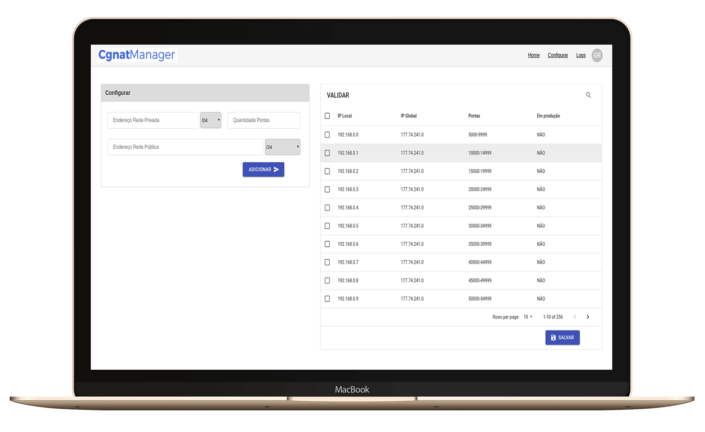

<h1 align="center">
    
</h1>

<h4 align="center">
  🚀 TCC do Curso de Ciência da Computação
</h4>

  
  
  
  
  
  

## 📱 Interfaces
A aplicação frontend conta com quatro interface, onde uma delas é para login, outra é a tela home do sistema onde são mostradas informações referentes ao servidor linux no qual ta sendo executado o cgnat-manager, outra utilizada para fazer a configuração das regras de CGNAT e por fim temos uma interface onde são mostrados os logs das configurações feitas no sistema.

    

## 🔄 Executar
- Entrar na pasta `frontend`;
 - Executar `yarn install` para instalar dependências do projeto;
 - Executar `yarn start` para que o projeto seja executado;

 ## 📝 Licença
Este projeto está sobre a licença MIT. Veja o arquivo [LICENSE](../LICENSE.md) para mais detalhes.

---
<h4 align="center">
  Feito com ❤️ by Gustavo Souza
</h4>
